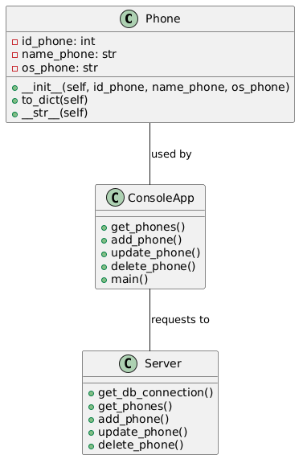

## Описание
Этот проект представляет собой систему управления данными о телефонах, состоящую из двух компонентов: сервера на Flask и консольного приложения для работы с данными в базе PostgreSQL. Система позволяет просматривать, добавлять, изменять и удалять информацию о телефонах.

## Состав проекта
Проект состоит из следующих директорий:
- `src/server` — серверная часть на Flask, обеспечивающая взаимодействие с базой данных PostgreSQL.
- `src/console_app` — консольное приложение на Python для управления данными о телефонах, отправляющее запросы серверу.
- `src/classes` — директория с классом `Phone`, который используется для представления данных о телефонах.

## Функциональные возможности
- Получение списка телефонов из базы данных.
- Добавление нового телефона.
- Обновление информации о телефоне.
- Удаление телефона по ID.

## Диаграмма классов


## Начало работы

### Установка

1. Клонируйте репозиторий:
   ```bash
   git clone https://github.com/darmu3/rest_api.git
2. Установите зависимости:
   ```bash
   pip install flask psycopg2 requests
3. Настройте подключение к базе данных PostgreSQL в `server.py` (в методе `get_db_connection`).

## Запуск
1. Запустите сервер:
    ```bash
   cd src/server
   python server.py
2. В отдельном окне терминала запустите консольное приложение:
    ```bash
   cd src/console_app
    python main.py

## Пример использования
В консольном приложении выберите одно из действий:
1. Показать все телефоны
2. Добавить телефон
3. Обновить телефон
4. Удалить телефон
5. Выйти

## Авторы
- Участник 1: Сунцов Александр
- Участник 2: Иванов Даниил